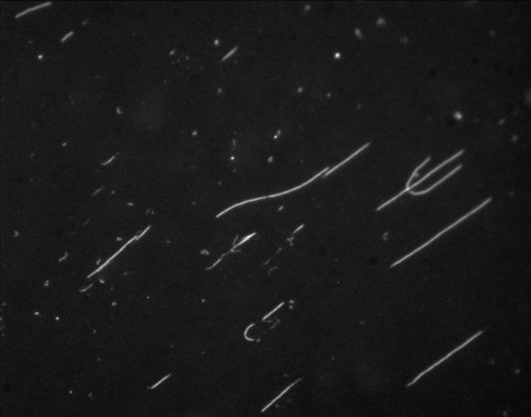
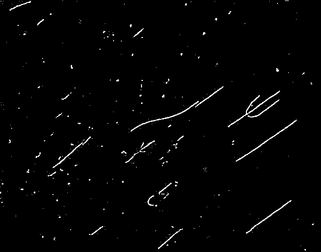
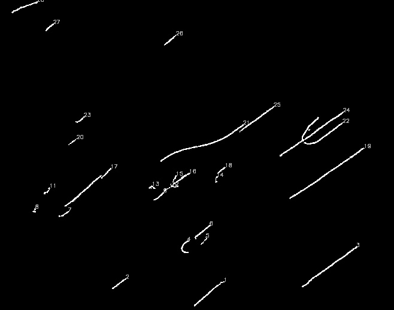

# Count and Label DNA strands
This is a proof of concept (POC) developed using **Python3**, **NumPy** and **OpenCV**, to count and label the number of _DNA strands_ from an image of _combed DNA molecules_.

The technique of **Adaptive Mean Thresholding** is used here.

### Sample DNA Image

### Image after thresholding

**Label** and **Length** values will be printed in _CSV_ format on the console window. Alternatively, these can be written to a file.

### Sample CSV output

number,length  
1,138.23758959770203  
2,61.25483310222626  
3,241.4335446357727  
4,68.35533821582794  
5,33.21320295333862  
6,73.98275470733643  
7,41.627416491508484  
8,22.14213538169861  
9,44.52691173553467  
10,25.727921843528748  
11,37.041630029678345  
12,24.242640614509583  
13,30.38477599620819  
14,25.899494767189026  
15,25.727921843528748  
16,75.91168713569641  
17,227.63455522060394  
18,33.45584309101105  
19,323.102591753006  
20,33.79898941516876  
21,331.119837641716  
22,162.2375875711441  
23,40.041630268096924  
24,386.52899849414825  
25,152.7228683233261  
26,54.84061932563782  
27,38.455843806266785  
28,102.91168713569641

### Labeled DNA Image

### Next steps:  
* Length values are in pixels. They need to be converted to the scientific length unit.
* Save Label and Length values to a file or database.

